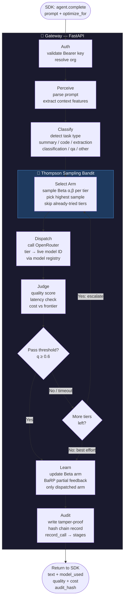
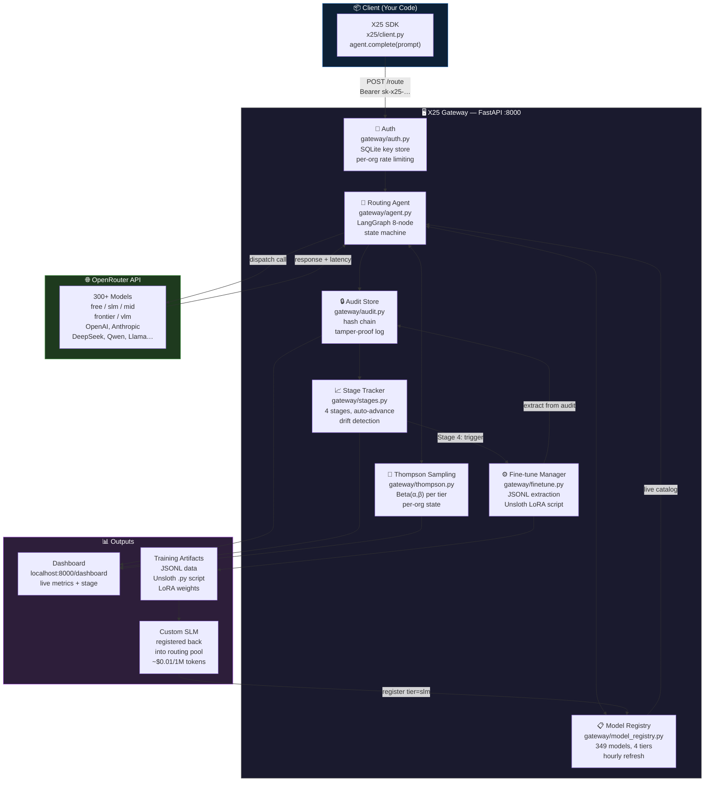
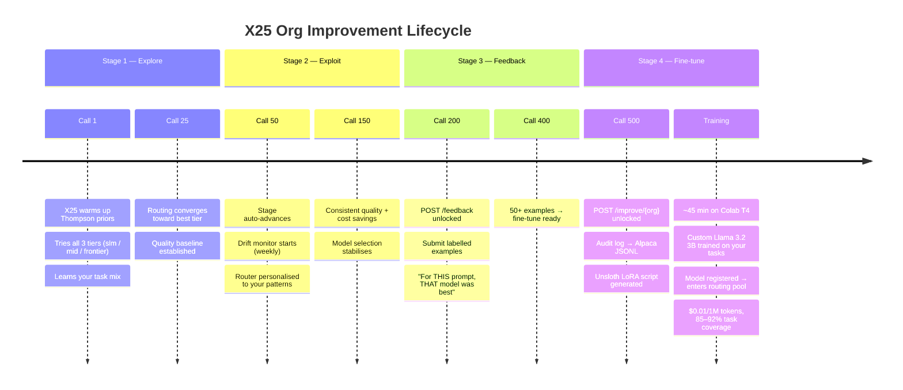
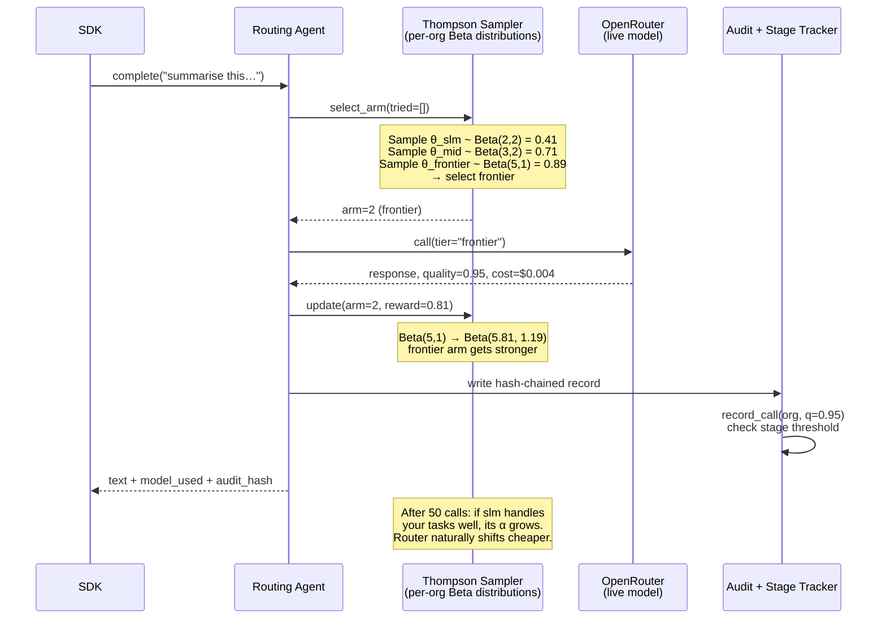

# X25 — Agentic Architecture Diagrams

---

## 1. Per-Call Agentic Routing Flow

LangGraph state machine — what happens every time you call `agent.complete()`.

---

## 2. System Architecture — All Components

How the five phases fit together as a single self-learning system.

---

## 3. Stage Progression Timeline

How an org autonomously moves through improvement stages over time.

---

## 4. Thompson Sampling — Bandit Learning Loop

How the router learns across calls within a single org.

---

## 5. Fine-tuning Data Pipeline

What Phase 5 does with your call history.

```mermaid
flowchart LR
    A["Audit Log\nSQLite\nevery call recorded"] --> B

    B["Extract Examples\nfor org at Stage 4\ntask_type + tier + reward\nquality + optimize_for"]

    B --> C["Format as\nAlpaca JSONL\ninstruction tuning format\n{instruction, input, output}"]

    C --> D["Generate\nUnsloth Script\nLlama 3.2 3B\nr=16 LoRA, 3 epochs\n4-bit quantised"]

    D --> E{GPU available?}

    E -- "Colab T4\n~45 min" --> F["LoRA Weights\noutput/lora_weights/"]
    E -- "Local RTX 3060+\nor Apple M1+" --> F
    E -- "Together AI API\n~$1–3, no GPU" --> F

    F --> G["POST /improve/{org}/register\nmodel_path=lora_weights/"]

    G --> H["Custom SLM\nregistered in registry\ntier=slm\n$0.01/1M tokens"]

    H --> I["Thompson Sampler\nexplores custom model\nif reward ≥ 0.6 consistently\n→ selected for 85–92% of calls"]

    style A fill:#1a1a2e,color:#fff
    style H fill:#1e3a1e,color:#fff
    style I fill:#1e3a5f,color:#fff
```

